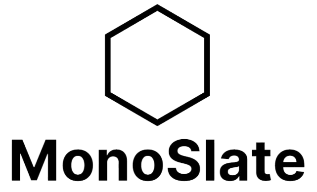

<a id="readme-top"></a>

<!-- PROJECT SHIELDS -->
<!--
*** I'm using markdown "reference style" links for readability.
*** Reference links are enclosed in brackets [ ] instead of parentheses ( ).
*** See the bottom of this document for the declaration of the reference variables
*** for contributors-url, forks-url, etc. This is an optional, concise syntax you may use.
*** https://www.markdownguide.org/basic-syntax/#reference-style-links
-->

[![Contributors][contributors-shield]][contributors-url]
[![Forks][forks-shield]][forks-url]
[![Stargazers][stars-shield]][stars-url]
[![Issues][issues-shield]][issues-url]
[![MIT License][license-shield]][license-url]
[![LinkedIn][linkedin-shield]][linkedin-url]

<!-- PROJECT LOGO -->
<br />
<div align="center">
  <a href="https://github.com/SalmanDeveloperz">
    
  </a>

  <p align="center">
    A sleek, fast, and fully customizable portfolio for everyone
    <br />
    <a href="https://biswajit-k.tech/"><strong>View Live »</strong></a>
    <br />
    <br />
    <a href="#getting-started">Quickstart</a>
    ·
    <a href="https://github.com/SalmanDeveloperz/website/issues">Report Bug</a>
    ·
    <a href="https://github.com/SalmanDeveloperz/website/issues">Request Feature</a>
  </p>
</div>

<!-- TABLE OF CONTENTS -->
<details>
  <summary>Table of Contents</summary>
  <ol>
    <li>
      <a href="#about-the-project">About The Project</a>
    </li>
    <li>
      <a href="#project-description">Project Description</a>
      <ul>
        <li><a href="#built-with">Built With</a></li>
      </ul>
    </li>
    <li>
      <a href="#getting-started">Getting Started</a>
      <ul>
        <li><a href="#prerequisites">Prerequisites</a></li>
        <li><a href="#installation">Installation</a></li>
        <li><a href="#building-for-production">Building For Production</a></li>
        <li><a href="#folder-structure">Folder Structure</a></li>
      </ul>
    </li>
    <li><a href="#future-improvements">Future Improvements</a></li>
    <li><a href="#contributing">Contributing</a></li>
    <li><a href="#license">License</a></li>
    <li><a href="#contact">Contact</a></li>
  </ol>
</details>

<!-- ABOUT THE PROJECT -->

## About The Project

This a black & white theme portfolio website template that you can quickly setup and customize to make it your own. The design is sleek yet well-organized with multiple sections to suit your needs regardless of which background you come from.

This project is a fork of [v4 of Brittany Chiang's portfolio website](https://github.com/bchiang7/v4) which is quite awesome. Make sure to check that out as well.

The key features are:

- **Sleek Design**: Modern, minimalist and consistent design
- **Organized Section**: Offers essential sections that suits everyone which are easy and intuitive to nagivate
- **Customizable Content**: Effortlessly update your content and sections with zero coding work.
- **Free Hosting**: Quickly and easily deploy your portfolio website for free on [Netlify](https://www.netlify.com/) or [Github Pages](https://pages.github.com/).

<p align="right">(<a href="#readme-top">back to top</a>)</p>

### Built With

- 
- 

<p align="right">(<a href="#readme-top">back to top</a>)</p>

<!-- GETTING STARTED -->

## Getting Started

To get a local copy up and running follow these simple steps.

### Prerequisites

Make sure that you have [Node.js](https://nodejs.org/en) installed as it would help in running the Gatsby server and [yarn](https://yarnpkg.com/) for installing the dependencies.

### Installation

1. Clone the repo

   ```sh
   git clone https://github.com/biswajit-k/MonoSlate.git
   ```

2. Install the Gatsby CLI

   ```sh
   npm install -g gatsby-cli
   ```

3. Install dependencies

   ```sh
   yarn
   ```

4. Start the development server

   ```sh
   npm start
   ```

Finally, below services will be running-

- Website: `http://localhost:8000`
- GraphiQL Server: `http://localhost:8000/___graphql`

### Building For Production

1. Generate a full static production build

   ```sh
   npm run build
   ```

1. Preview the site as it will appear once deployed

   ```sh
   npm run serve
   ```

<p align="right">(<a href="#readme-top">back to top</a>)</p>

### Folder Structure

```
├── gatsby-config.js
├── gatsby-node.js
├── prettier.config.js
├── .babelrc
├── .editorconfig
├── .eslintrc
├── README.md
├── LICENSE
├── package.json
└── content
      └── about
      └── draft
      └── jobs
      └── posts
      └── projects
      └── resume
└── src
      └── components
        ├── icons
        ├── sections
        ├── *layout files*
      └── fonts
      └── hooks
      └── images
        └── icons
        ├── logo.png
      └── pages
      └── styles
            ├── GlobalStyle.js
            ├── variables.js
      └── templates
      └── utils
      ├── config.js
└── static
      ├── resume.pdf

```

Below are some details for important files you would deal with while customizing the template for your use-

`content` folder contains all your personal details that would be automatically fetched and reflected on the website. Also the `config.js` file inside `src` folder with your details.

`src` folder contains all the source files for any customization.

- `images` folder contains logo images
- `components` folder contains the layout files like header, footer, etc
- `pages` folder contains all the pages of the website. You can add your own page folder which would be accessible at `https://localhost:8000/<folder-name>`
- `styles` folder contains the common styling used in the website. For customizations, you would mostly work with `GlobalStyle.js` and `variables.js` files.

`static` folder contains all the static files you would want to serve in your website. These can also be assible at `https://localhost:8000/<file-name>` directly.

`gatsby-config.js` and `gatsby-node.js` files contain some other details like plugins and metadata that you might want to look at.

**Note**

_If you wish to just modify the content and keep the design same. You just have to modify `content`, `static` folders and `config.js` file. That's it._

<p align="right">(<a href="#readme-top">back to top</a>)</p>

<!-- ROADMAP -->

## Future Improvements

code refactor - redundant, Extraneous code, featured section design,  
The template is ready to be used, however like always, there are scope of improvements that I see which I have listed down below-

**Code Refactoring**

There is a lot of code, especially styling which is redundant. Also, some parts of extraneous code exist.

**Template Usability**

Current template is provides good flexibility in customizing content overall. However, some improvements can be made to improve it further like option to add custom logo, flexibility in changing design, re-arranging sections like lego blocks adn more.

**Improving Accessibility**

General HTML need to be replaced with semantic version, navigating sections through keyboard navigation, use of ARIA attributes and other practices for improving accessibility need to be implemented.

**Featured Section Design**

I want to have a different design for the featured section on the home page, the current one don't completely sync with the overall design.

Apart from that, I am open to more suggestions, you can always open an issue and we can discuss and build on it further.

See the [contribution section](#contributing) on how yo propose improvements.

<p align="right">(<a href="#readme-top">back to top</a>)</p>

<!-- CONTRIBUTING -->

## Contributing

Contributions are what makes the open-source community such an amazing place to learn, inspire, and create. Any contributions you make are **greatly appreciated**.

If you have a suggestion that would make this better, please fork the repo and create a pull request. You can also simply open an issue with the tag "enhancement".

1. Fork the Project
2. Create your Feature Branch (`git checkout -b feature/AmazingFeature`)
3. Commit your Changes (`git commit -m 'Add some AmazingFeature'`)
4. Push to the Branch (`git push origin feature/AmazingFeature`)
5. Open a Pull Request

<p align="right">(<a href="#readme-top">back to top</a>)</p>

<!-- LICENSE -->

## License

Distributed under the MIT License. See `LICENSE.txt` for more information.

<p align="right">(<a href="#readme-top">back to top</a>)</p>

<!-- CONTACT -->

## Contact

[](https://x.com/chsalman199/)

[](https://www.linkedin.com/in/msalman199/)

[](mailto:chmsalman199@gmail.com)

<p align="right">(<a href="#readme-top">back to top</a>)</p>

<!-- ACKNOWLEDGMENTS -->

Don't forget to give the project a star! Thanks again!

<!-- MARKDOWN LINKS & IMAGES -->
<!-- https://www.markdownguide.org/basic-syntax/#reference-style-links -->

[contributors-shield]: https://img.shields.io/github/contributors/biswajit-k/MonoSlate.svg?style=for-the-badge
[contributors-url]: https://github.com/SalmanDeveloperz/graphs/contributors
[forks-shield]: https://img.shields.io/github/forks/SalmanDeveloperz/website.svg?style=for-the-badge
[forks-url]: https://github.com/SalmanDeveloperz/website/network/members
[stars-shield]: https://img.shields.io/github/stars/SalmanDeveloperz/website.svg?style=for-the-badge
[stars-url]: https://github.com/SalmanDeveloperz/website/stargazers
[issues-shield]: https://img.shields.io/github/issues/SalmanDeveloperz/website.svg?style=for-the-badge
[issues-url]: https://github.com/SalmanDeveloperz/website/issues
[license-shield]: https://img.shields.io/github/license/SalmanDeveloperz/website.svg?style=for-the-badge
[license-url]: https://github.com/SalmanDeveloperz/website/blob/master/LICENSE.txt
[linkedin-shield]: https://img.shields.io/badge/-LinkedIn-black.svg?style=for-the-badge&logo=linkedin&colorB=555
[linkedin-url]: https://www.linkedin.com/in/msalman199/
